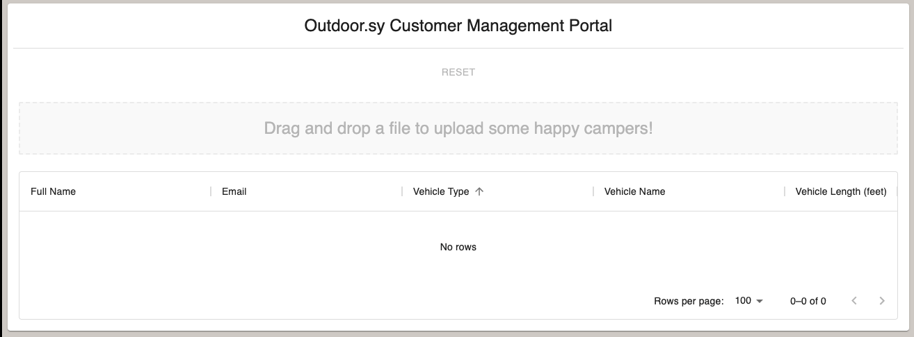

# customer-admin-portal

## Intended Audience

This documentation is intended for use by developers who want to incorporate the standalone`customer-admin-portal`
component into their React project.

If you're looking for developer documentation for the component itself, go [here](./docs/developer.md).

## Overview

> This component was created to be part of my developer portfolio. It's not really intended for real use by production apps.

This React component is meant to be a drop-in solution for uploading and rendering lists of customers.

It is meant for use with a computer screen rather than mobile, though it is responsive and won't look totally horrible
on mobile screens.

## Installation

```sh
npm i customer-admin-portal-kaylakantola
```

## Usage

### Minimal example

Simply import the component and render it inside a React application.

```js
import React from 'react';
import ReactDOM from 'react-dom';
import {CustomerAdminPortal} from 'customer-admin-portal-kaylakantola';

ReactDOM.render(
    <React>
        <CustomerAdminPortal/>
    </React>,
    document.getElementById('root')
);
```

This will render the following UI: 



### Props 

| Name | Type | Description                             | Required | Default       |
| --- |------|-----------------------------------------|----------|---------------|
| `companyName` | `string`  | Name of the company using the dashboard | No        | `"Outdoor.sy"` |

### Advanced Example 

```js
import React from 'react';
import ReactDOM from 'react-dom';
import {CustomerAdminPortal} from 'customer-admin-portal-kaylakantola';

ReactDOM.render(
    <React>
        <CustomerAdminPortal companyName={"KaylaCorp"} />
    </React>,
    document.getElementById('root')
);
```

## Future enhancements 

Allow for further configuration via passed-in props, such as:

1. Max file size (Currently, it will only accept files smaller than 1mb)
2. Accepted file type(s) (Currently, it will only accept text files)
3. Column headers (Currently, it will only accept files adhering to a specific set of headers)
4. Schema validation (Currently, no schema validation)


## Changelog

See the [changelog here](./docs/changelog.md).

