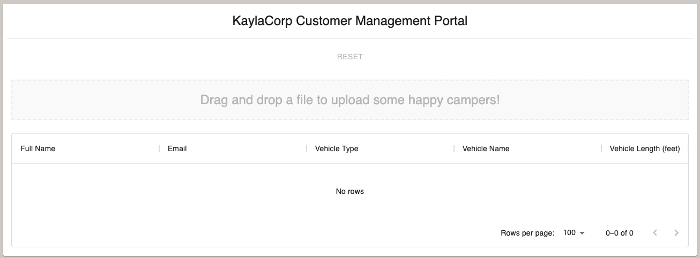

# customer-admin-portal

## Really Quick Quickstart

```bash
git clone https://github.com/kaylakantola/customer-admin-portal.git
cd customer-admin-portal
npm i
npm run start
```

Visit `localhost:3000` in your browser to see the component rendered.

## Intended Audience

The following documentation is intended for use by developers who want to incorporate the standalone`customer-admin-portal-kaylakantola`
component into their React project.

If you're looking for developer documentation for the component itself, go [here](./docs/developer.md).

## Overview

> This component was created to be part of my developer portfolio. It's not really intended for real use by production apps.

This React component is meant to be a drop-in solution for uploading and rendering lists of customers.

It is meant for use with a computer screen rather than mobile, though it is responsive and won't look totally horrible
on mobile screens.

## Installation

```sh
npm i customer-admin-portal-kaylakantola
```

## Usage

> Your react app MUST be using `"react": "^17.0.2"` & `"react-dom": "^17.0.2"`

### Minimal example

Simply import the component and render it inside a React application.

```js
import React from 'react';
import ReactDOM from 'react-dom';
import {CustomerAdminPortal} from 'customer-admin-portal-kaylakantola';

ReactDOM.render(
    <React>
        <CustomerAdminPortal/>
    </React>,
    document.getElementById('root')
);
```

This will render the following UI:


### Props

| Name | Type | Description                             | Required | Default       |
| --- |------|-----------------------------------------|----------|---------------|
| `companyName` | `string`  | Name of the company using the dashboard | No        | `"Outdoor.sy"` |

### Advanced Example

You can configure the name of the company by passing in a `companyName` prop.

```js
import React from 'react';
import ReactDOM from 'react-dom';
import {CustomerAdminPortal} from 'customer-admin-portal-kaylakantola';

ReactDOM.render(
    <React>
        <CustomerAdminPortal companyName={"KaylaCorp"}/>
    </React>,
    document.getElementById('root')
);
```

This will render the following UI:



### Data File Upload Requirements

Files must be of type `text/plain` and under `1mb`.

Files must be `comma` or `pipe` delimited data.

The columns must match these headers:

| "firstName" | "lastName" | "email" | "vehicleType" | "vehicleName" | "vehicleLength" |
| --- |--- |--- |--- |--- |-----------------|
| "Kayla" | "Kantola" | "krkantola@gmail.com" | "skateboard" | "ol' faithful" | "2 ft"            |

To see example acceptable files, check out [commas.txt](./commas.txt) or [pipes.txt](pipes.txt).


## Future enhancements

1. Allow for further configuration via passed-in props, such as:
   1. Max file size (Currently, it will only accept files smaller than 1mb)
   2. Accepted file type(s) (Currently, it will only accept text files)
   3. Column headers (Currently, it will only accept files adhering to a specific set of headers)
   4. Schema validation (Currently, no schema validation)
2. Optimize export to reduce overall package size & dependencies
3. Add support for earlier versions of react and node

## Changelog

See the [changelog here](./docs/changelog.md).

