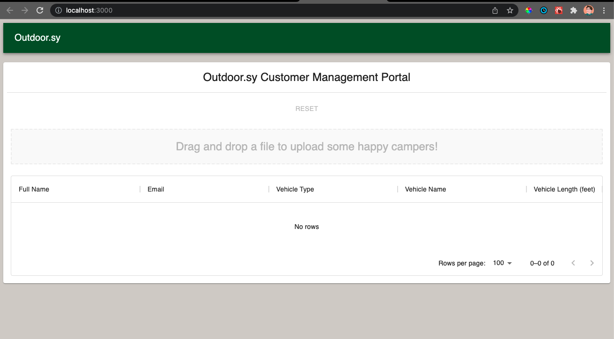

# Developer Documentation

## Intended Audience

This documentation is intended for developers who want to work on the `customer-admin-portal-kaylakantola` component, or just understand how it works under the hood.

## Prerequisites 

1. Familiarity with javascript, react, node
2. Latest LTS version of node installed on your computer ([here's how you do that](https://heynode.com/tutorial/install-nodejs-locally-nvm/))

## Quickstart

```bash
git clone https://github.com/kaylakantola/customer-admin-portal.git
cd customer-admin-portal
npm i
npm run start
```

Visit `localhost:3000` in your browser to see the component rendered. 

## Getting Started

Clone the repository, cd into the directory, and install the dependencies.

```bash
git clone https://github.com/kaylakantola/customer-admin-portal.git
cd customer-admin-portal
npm i
```

The code for the component lives in `customer-admin-portal/src/lib`.

To render the component in your browser, run the following command from the root of the repository:

```bash
npm run start
```

This is what you should see:



Hit `ctrl` + `c` to shut down the app.

## Making Updates

Your entry point for making updates will be `customer-admin-portal/src/lib/components/CustomerAdminPortal.js`.

`CustomerAdminPortal` is the only export of the `lib` folder, and it is what end users will have access to when they import the package.

All other components in that folder are smaller pieces that are composed together to make up the component.

The `utils` folder contains functions that do not involve ui components. 

## Tools 

1. [Material UI](https://mui.com/getting-started/usage/) for UI components
2. [React Dropzone](https://react-dropzone.js.org/) for file upload 
3. [csv-string](https://www.npmjs.com/package/csv-string) for parsing the input file
4. [React Testing Library](https://testing-library.com/docs/react-testing-library/intro/) for testing


## Tests 

Each component and utility function should have a corresponding test in the parent folder's `__tests__` folder.

Right now they are very minimal! 

To run tests, run:

```bash
npm run test
```

Your terminal output should contain something like this:

```bash
Test Suites: 6 passed, 6 total
Tests:       11 passed, 11 total
Snapshots:   0 total
Time:        5.593 s
Ran all test suites.
```

## Deploying 

> You will only be able to deploy if you are granted collaborator rights on the npm package - ask Kayla to add you!

Once you have made a change and updated/added any necessary tests, do the following:

1. Bump up the semver using `npm version major`, `npm version minor`, or `npm version patch` [depending on the changes you made](https://semver.org/#summary) 
2. Update the [changelog](./changelog.md)
3. Run `npm run build`
4. Run `npm publish` 


